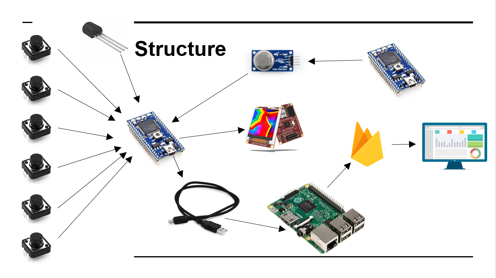
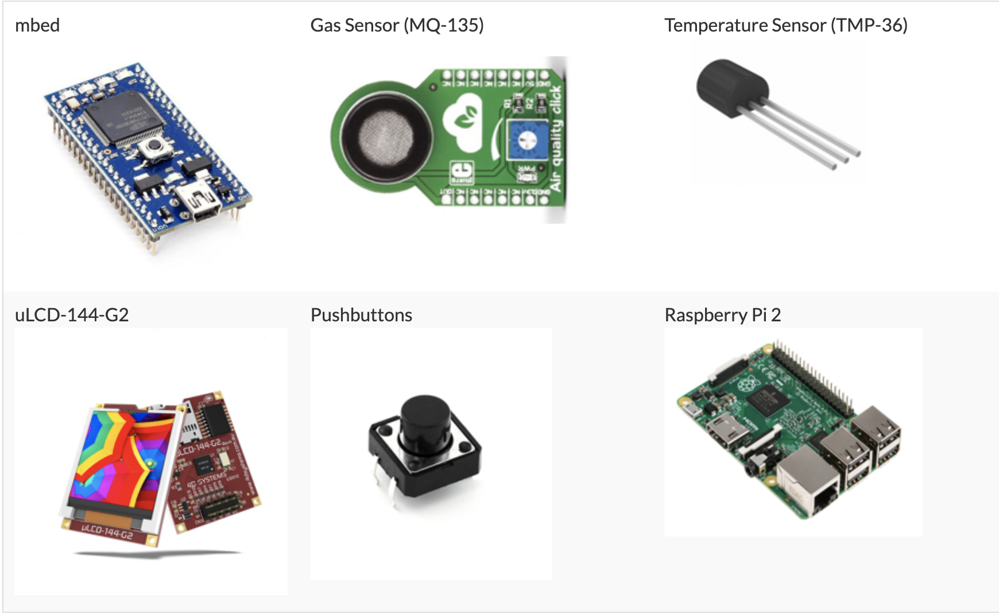
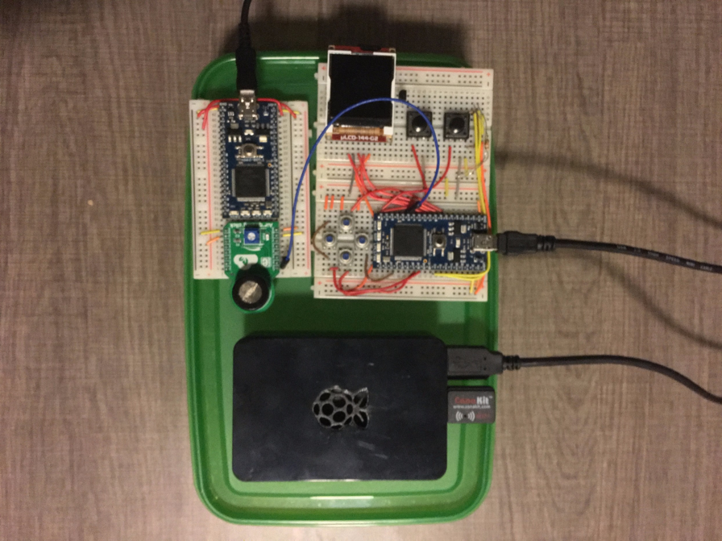

# FridgeHound - The Smart Tupperware

### Authors:
Orlando G. Rodriguez, Pedro Henrique Ribeiro Pinto

## Description

Have you ever forgot something on the fridge and by time you opened it the food had gone bad? Or maybe you opened a tupperware and wasn't too sure if the food was still good? Well, you are not alone. The average american household wastes around 25% of the food they purchase. This was the main reason why we decide to create FridgeHound. FridgeHound is a Smart Tupperware that uses the mq-135 gas sensor to track your food. With an easy to use interface you can store different type of foods and the sensor will estimate how much time you have left. We also added a thermometer so you can keep track of your fridge's temperature. The best part is that you can access all this information from a web application anywhere you go. The gas sensor and thermometer send information via serial usb to a Raspberry Pi 2, which sends that information to our web application's database. This way, you always have the most up to date information anywhere you go.

## System Diagram

## Hardware Components

## Hardware Prototype

## Pin-out Connections

## Demos

- ### Smart Tupperware:

- ### Web Interface:
